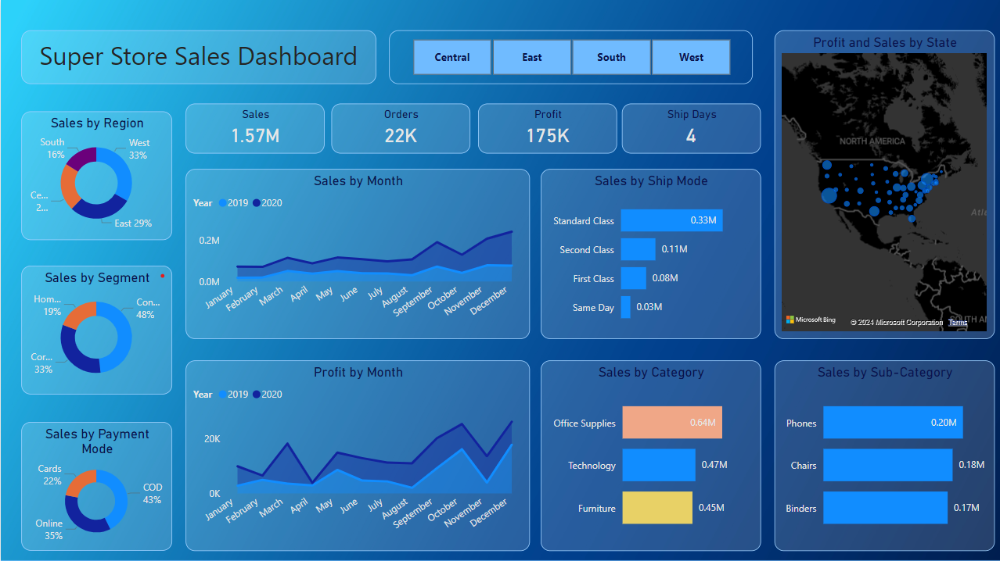
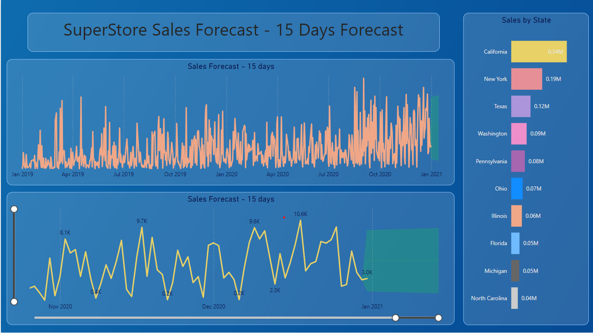

# 🛒 Global Superstore Sales Performance: End-to-End Analysis & Time-Series Forecasting

An enterprise-grade retail analytics platform engineered to ingest corporate transaction data, uncover localized consumer segment trends, evaluate product category profitability, and deliver actionable 15-day revenue projections using historical time-series forecasting models.

---

## 📊 Dashboard Preview
*Note: Due to local desktop environment security restrictions, the interactive cloud service link is limited to authenticated internal tenants. Please find the executive visual reports detailed below or download the native dataset and working binaries inside the `/frontend` directory to interface directly with dynamic slicers.*

### Executive Sales Summary

### Sales Forecasting & Performance

---

## 🎯 Strategic Business Objectives
This end-to-end data pipeline was deployed across four distinct analytical phases to address critical operational and retail execution challenges:

* **Executive Visual Reporting:** Formulated a polished, executive-ready interface utilizing strict design principles, intuitive color hierarchies, and seamless cross-filtering capabilities for granular regional performance exploration.
* **Commercial Diagnostics:** Conducted historical analysis across core consumer segments (Consumer, Corporate, Home Office), localized regions, and product categories (Furniture, Office Supplies, Technology) to evaluate sales strategy footprints.
* **Predictive Sales Forecasting:** Engineered a robust, automated 15-day forward-looking time-series model to map out upcoming consumer demand patterns and minimize inventory stockouts.
* **Actionable Operational Insights:** Synthesized core diagnostic findings into strategic business takeaways focused on procurement optimization, targeted retail campaigns, and higher overall operational efficiency.

---

## 🛠️ Architecture & Technology Stack
* **Reporting & Data Visualization:** Power BI Desktop (Advanced DAX Expressions, Interactive Slicers, Custom Cross-Filtering Matrices).
* **Data Transformation & ETL:** Power Query Engine (Schema Enforcement, Column Optimization, Data Type Cleansing).
* **Predictive Analytics:** Power BI Time-Series Engine via Exponential Smoothing (ETS) Modeling.

---

## 📂 Core Repository Architecture
The files in this repository are compartmentalized into distinct layers to separate data processing from user reporting:
* **`/frontend`** - Hosts the compiled native Power BI binary workflow (`.pbix`) alongside high-resolution static asset sheets of the dashboard pages (`1.png`, `2.png`).
* **`/backend`** - Houses the foundational transactional dataset analyzed for this case study.

---

## 📊 Foundational Data Source
* **Target Dataset:** SuperStore Sales Corporate Record (Stored as a structured `.csv` format inside the `/backend` folder).
* **File Reference:** `backend/SuperStore_Sales_Dataset.csv`
* **Dimensional Depth:** Extensive historical transaction lineages including unique Order IDs, Order Dates, Shipping Modes, Customer Demographics, Regional Geographies, Product Categories, Sub-Categories, and structural sales/profitability metrics.
